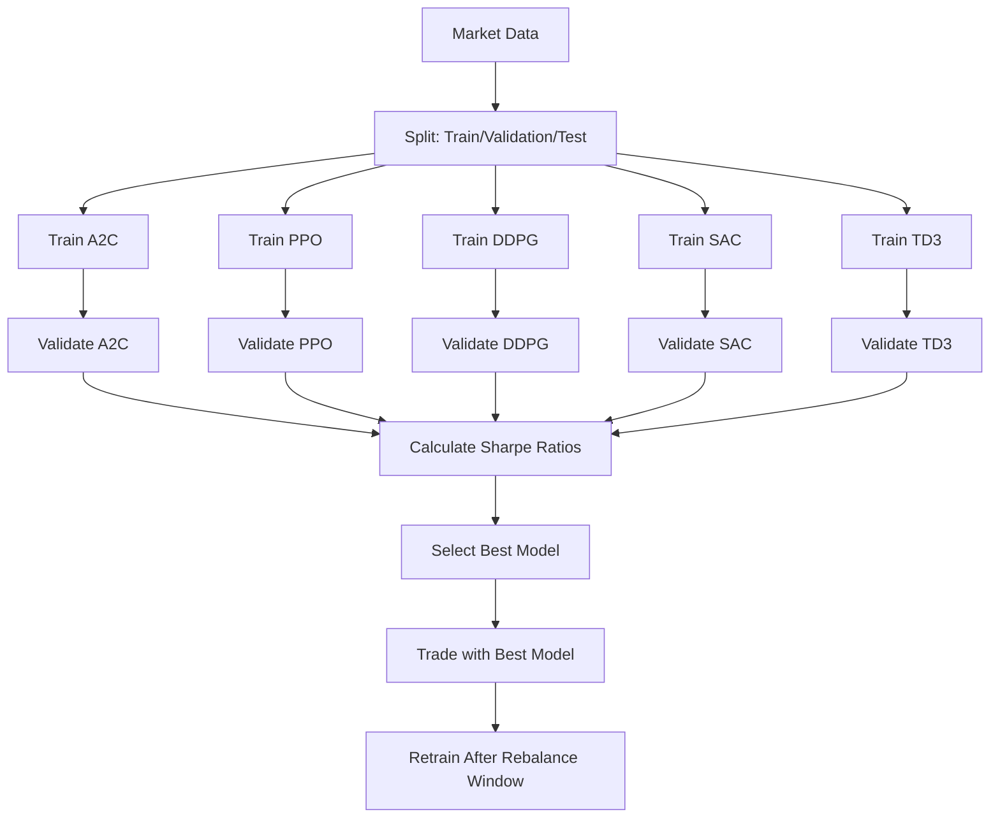

# Ensemble Methods

## Overview

Ensemble methods combine multiple machine learning models to create more robust and accurate predictions. FinRL's `DRLEnsembleAgent` implements dynamic model selection, choosing the best-performing algorithm for each market condition.

## DRLEnsembleAgent Architecture

The ensemble approach works by:

1. **Training Multiple Models**: A2C, PPO, DDPG, SAC, and TD3 are trained simultaneously
2. **Validation Performance**: Each model is evaluated on a validation period
3. **Dynamic Selection**: The best-performing model (highest Sharpe ratio) is selected for trading
4. **Rolling Windows**: Models are retrained periodically as new data becomes available



## Basic Usage

### Simple Ensemble Strategy

```python
from finrl.agents.stablebaselines3.models import DRLEnsembleAgent
from finrl.meta.preprocessor.preprocessors import data_split

# Initialize ensemble agent
ensemble_agent = DRLEnsembleAgent(
    df=processed_data,
    train_period=("2020-01-01", "2021-01-01"),
    val_test_period=("2021-01-01", "2022-01-01"), 
    rebalance_window=63,        # Retrain every 63 days (quarterly)
    validation_window=63,       # Use 63 days for validation
    **env_kwargs
)

# Define model configurations
A2C_model_kwargs = {"n_steps": 10, "ent_coef": 0.005, "learning_rate": 0.0007}
PPO_model_kwargs = {"ent_coef": 0.01, "n_steps": 2048, "learning_rate": 0.00025}
DDPG_model_kwargs = {"buffer_size": 50000, "learning_rate": 0.0005, "batch_size": 128}
SAC_model_kwargs = {"ent_coef": "auto", "learning_rate": 0.0001}
TD3_model_kwargs = {"policy_delay": 2, "batch_size": 100}

# Training timesteps for each algorithm
timesteps_dict = {
    "a2c": 50000,
    "ppo": 50000, 
    "ddpg": 50000,
    "sac": 50000,
    "td3": 50000
}

# Run ensemble strategy
df_summary = ensemble_agent.run_ensemble_strategy(
    A2C_model_kwargs=A2C_model_kwargs,
    PPO_model_kwargs=PPO_model_kwargs,
    DDPG_model_kwargs=DDPG_model_kwargs,
    SAC_model_kwargs=SAC_model_kwargs, 
    TD3_model_kwargs=TD3_model_kwargs,
    timesteps_dict=timesteps_dict
)

print("Ensemble Strategy Summary:")
print(df_summary)
```

## Advanced Ensemble Configurations

### 1. Weighted Ensemble

Instead of selecting a single best model, combine predictions from multiple top performers:

```python
class WeightedEnsembleAgent(DRLEnsembleAgent):
    """Ensemble agent that weights predictions by performance"""
    
    def __init__(self, *args, **kwargs):
        super().__init__(*args, **kwargs)
        self.top_k = 3  # Use top 3 models
        
    def weighted_prediction(self, models, sharpe_ratios, state):
        """Make weighted predictions based on Sharpe ratios"""
        
        # Get top k models
        sorted_indices = np.argsort(sharpe_ratios)[-self.top_k:]
        top_models = [models[i] for i in sorted_indices]
        top_sharpes = [sharpe_ratios[i] for i in sorted_indices]
        
        # Calculate weights (higher Sharpe = higher weight)
        weights = np.array(top_sharpes)
        weights = np.exp(weights) / np.sum(np.exp(weights))  # Softmax
        
        # Get predictions from each model
        predictions = []
        for model in top_models:
            pred, _ = model.predict(state, deterministic=True)
            predictions.append(pred)
        
        # Weighted average
        final_prediction = np.average(predictions, axis=0, weights=weights)
        return final_prediction, weights

# Usage
weighted_agent = WeightedEnsembleAgent(
    df=processed_data,
    **ensemble_kwargs
)
```

### 2. Market Regime-Based Ensemble

Select models based on detected market regimes:

```python
def detect_market_regime(prices, window=30):
    """Detect market regime based on volatility and trend"""
    
    # Calculate volatility
    returns = prices.pct_change()
    volatility = returns.rolling(window).std().iloc[-1]
    
    # Calculate trend
    sma_short = prices.rolling(10).mean().iloc[-1] 
    sma_long = prices.rolling(30).mean().iloc[-1]
    trend = (sma_short - sma_long) / sma_long
    
    # Classify regime
    if volatility > 0.03:  # High volatility
        if trend > 0.02:
            return "bull_volatile"
        elif trend < -0.02:
            return "bear_volatile" 
        else:
            return "sideways_volatile"
    else:  # Low volatility
        if trend > 0.01:
            return "bull_calm"
        elif trend < -0.01:
            return "bear_calm"
        else:
            return "sideways_calm"

class RegimeBasedEnsemble:
    """Select models based on market regime"""
    
    def __init__(self):
        # Best models for each regime (based on historical testing)
        self.regime_models = {
            "bull_volatile": "sac",      # SAC handles volatility well
            "bear_volatile": "td3",      # TD3 for bear markets
            "sideways_volatile": "ppo",  # PPO for ranging markets
            "bull_calm": "ddpg",         # DDPG for trending markets
            "bear_calm": "a2c",          # A2C for defensive
            "sideways_calm": "ppo"       # PPO for ranging markets
        }
        
    def select_model(self, price_data, trained_models):
        """Select model based on current market regime"""
        regime = detect_market_regime(price_data)
        selected_algorithm = self.regime_models[regime]
        
        print(f"Detected regime: {regime}, Selected model: {selected_algorithm}")
        return trained_models[selected_algorithm]

# Usage
regime_ensemble = RegimeBasedEnsemble()
current_regime = detect_market_regime(recent_prices)
selected_model = regime_ensemble.select_model(recent_prices, all_trained_models)
```

### 3. Risk-Adjusted Ensemble

Select models based on risk-adjusted returns rather than just Sharpe ratio:

```python
def calculate_risk_metrics(returns):
    """Calculate comprehensive risk metrics"""
    
    # Basic metrics
    mean_return = returns.mean()
    volatility = returns.std()
    sharpe = mean_return / volatility if volatility > 0 else 0
    
    # Advanced metrics
    downside_returns = returns[returns < 0]
    downside_deviation = downside_returns.std() if len(downside_returns) > 0 else 0
    sortino = mean_return / downside_deviation if downside_deviation > 0 else 0
    
    # Maximum drawdown
    cumulative = (1 + returns).cumprod()
    peak = cumulative.expanding(min_periods=1).max()
    drawdown = (cumulative - peak) / peak
    max_drawdown = drawdown.min()
    
    # Calmar ratio
    calmar = mean_return / abs(max_drawdown) if max_drawdown != 0 else 0
    
    return {
        'sharpe': sharpe,
        'sortino': sortino, 
        'calmar': calmar,
        'max_drawdown': max_drawdown,
        'volatility': volatility
    }

def risk_adjusted_scoring(performance_metrics):
    """Create composite score from multiple risk metrics"""
    
    # Weights for different metrics
    weights = {
        'sharpe': 0.4,
        'sortino': 0.3,
        'calmar': 0.2,
        'max_drawdown': -0.1  # Negative because lower is better
    }
    
    # Normalize metrics (simple z-score)
    normalized = {}
    for metric, values in performance_metrics.items():
        if len(values) > 1:
            mean_val = np.mean(values)
            std_val = np.std(values)
            normalized[metric] = [(v - mean_val) / std_val if std_val > 0 else 0 for v in values]
        else:
            normalized[metric] = [0] * len(values)
    
    # Calculate composite scores
    composite_scores = []
    for i in range(len(list(performance_metrics.values())[0])):
        score = sum(weights.get(metric, 0) * normalized[metric][i] 
                   for metric in normalized.keys() if metric in weights)
        composite_scores.append(score)
    
    return composite_scores

class RiskAdjustedEnsemble(DRLEnsembleAgent):
    """Ensemble with comprehensive risk-adjusted model selection"""
    
    def get_validation_score(self, iteration, model_name):
        """Override to use risk-adjusted scoring instead of just Sharpe"""
        
        # Get validation results
        df_total_value = pd.read_csv(f"results/account_value_validation_{model_name}_{iteration}.csv")
        daily_returns = df_total_value["account_value"].pct_change().dropna()
        
        # Calculate risk metrics
        risk_metrics = calculate_risk_metrics(daily_returns)
        
        # Create composite score
        score = (risk_metrics['sharpe'] * 0.4 + 
                risk_metrics['sortino'] * 0.3 + 
                risk_metrics['calmar'] * 0.2 +
                (1 + risk_metrics['max_drawdown']) * 0.1)  # Max DD is negative
        
        return score
```

## Performance Analysis and Monitoring

### Ensemble Performance Tracking

```python
def analyze_ensemble_performance(df_summary):
    """Analyze ensemble strategy performance"""
    
    # Model selection frequency
    model_counts = df_summary['Model Used'].value_counts()
    print("Model Selection Frequency:")
    for model, count in model_counts.items():
        percentage = (count / len(df_summary)) * 100
        print(f"  {model}: {count} times ({percentage:.1f}%)")
    
    # Performance by model
    performance_by_model = {}
    for model in model_counts.index:
        model_rows = df_summary[df_summary['Model Used'] == model]
        # Assuming we have return data for each period
        avg_sharpe = model_rows[f'{model} Sharpe'].mean()
        performance_by_model[model] = avg_sharpe
    
    print("\nAverage Sharpe Ratio by Selected Model:")
    for model, sharpe in performance_by_model.items():
        print(f"  {model}: {sharpe:.3f}")
    
    # Best performing periods
    best_periods = df_summary.loc[df_summary['A2C Sharpe'].idxmax():df_summary['TD3 Sharpe'].idxmax()]
    print(f"\nBest performing period: {best_periods['Val Start'].iloc[0]} to {best_periods['Val End'].iloc[0]}")
    
    return model_counts, performance_by_model

# Usage
model_frequency, model_performance = analyze_ensemble_performance(df_summary)
```

### Real-time Ensemble Monitoring

```python
class EnsembleMonitor:
    """Monitor ensemble performance in real-time"""
    
    def __init__(self):
        self.performance_history = []
        self.model_history = []
        self.alert_thresholds = {
            'sharpe_decline': -0.5,     # Alert if Sharpe drops by 0.5
            'drawdown_limit': -0.15,    # Alert if drawdown > 15%
            'model_instability': 3      # Alert if model changes 3+ times rapidly
        }
    
    def update_performance(self, current_return, selected_model):
        """Update performance tracking"""
        self.performance_history.append(current_return)
        self.model_history.append(selected_model)
        
        # Keep only recent history (e.g., last 30 periods)
        if len(self.performance_history) > 30:
            self.performance_history.pop(0)
            self.model_history.pop(0)
        
        self.check_alerts()
    
    def check_alerts(self):
        """Check for performance alerts"""
        if len(self.performance_history) < 10:
            return
        
        # Calculate recent Sharpe
        recent_returns = np.array(self.performance_history[-10:])
        recent_sharpe = np.mean(recent_returns) / np.std(recent_returns) if np.std(recent_returns) > 0 else 0
        
        # Calculate drawdown
        cumulative = np.cumprod(1 + np.array(self.performance_history))
        peak = np.maximum.accumulate(cumulative)
        drawdown = (cumulative - peak) / peak
        current_drawdown = drawdown[-1]
        
        # Check model stability
        recent_models = self.model_history[-5:]
        model_changes = len(set(recent_models))
        
        # Generate alerts
        if recent_sharpe < self.alert_thresholds['sharpe_decline']:
            print(f"⚠️ ALERT: Sharpe ratio declined to {recent_sharpe:.3f}")
        
        if current_drawdown < self.alert_thresholds['drawdown_limit']:
            print(f"🚨 ALERT: Drawdown reached {current_drawdown:.1%}")
        
        if model_changes >= self.alert_thresholds['model_instability']:
            print(f"⚡ ALERT: High model instability - {model_changes} changes in 5 periods")

# Usage
monitor = EnsembleMonitor()

# During trading loop
for period in trading_periods:
    current_return = calculate_period_return()
    selected_model = ensemble_agent.get_current_model()
    monitor.update_performance(current_return, selected_model)
```

## Custom Ensemble Strategies

### 1. Sector-Based Ensemble

Different models for different asset classes:

```python
class SectorEnsemble:
    """Ensemble with different models for different sectors"""
    
    def __init__(self):
        self.sector_models = {
            'tech': ['sac', 'td3'],      # High volatility sectors
            'finance': ['ppo', 'ddpg'],   # More stable sectors  
            'crypto': ['sac', 'ppo'],     # 24/7 markets
            'commodities': ['a2c', 'ddpg'] # Trend-following
        }
    
    def get_asset_sector(self, ticker):
        """Classify asset by sector"""
        tech_stocks = ['AAPL', 'GOOGL', 'MSFT', 'NVDA']
        finance_stocks = ['JPM', 'BAC', 'GS', 'WFC'] 
        crypto_assets = ['BTC-USD', 'ETH-USD', 'ADA-USD']
        
        if ticker in tech_stocks:
            return 'tech'
        elif ticker in finance_stocks:
            return 'finance'
        elif ticker in crypto_assets:
            return 'crypto'
        else:
            return 'commodities'  # Default
    
    def select_models_for_portfolio(self, tickers):
        """Select appropriate models for each asset"""
        model_selection = {}
        for ticker in tickers:
            sector = self.get_asset_sector(ticker)
            model_selection[ticker] = self.sector_models[sector]
        return model_selection
```

### 2. Time-Based Ensemble

Different models for different time periods:

```python
class TimeBasedEnsemble:
    """Select models based on time patterns"""
    
    def __init__(self):
        self.time_models = {
            'market_open': 'sac',     # High volatility at open
            'mid_day': 'ppo',         # Calmer mid-day trading
            'market_close': 'td3',    # EOD positioning
            'overnight': 'ddpg'       # Overnight gaps
        }
    
    def get_time_period(self, timestamp):
        """Classify current time period"""
        hour = timestamp.hour
        
        if 9 <= hour <= 10:  # Market open
            return 'market_open'
        elif 11 <= hour <= 14:  # Mid-day
            return 'mid_day' 
        elif 15 <= hour <= 16:  # Market close
            return 'market_close'
        else:  # After hours
            return 'overnight'
    
    def select_model_by_time(self, current_time, trained_models):
        """Select model based on current time"""
        time_period = self.get_time_period(current_time)
        selected_algorithm = self.time_models[time_period]
        return trained_models[selected_algorithm]
```

## Best Practices

### 1. Model Diversity

Ensure your ensemble includes diverse algorithms:

```python
# Good diversity - different algorithm types
diverse_config = {
    'on_policy': ['a2c', 'ppo'],      # On-policy methods
    'off_policy': ['ddpg', 'sac', 'td3'],  # Off-policy methods
    'stochastic': ['ppo', 'sac'],     # Stochastic policies
    'deterministic': ['ddpg', 'td3']  # Deterministic policies
}
```

### 2. Validation Strategy

Use proper validation to avoid overfitting:

```python
# Walk-forward validation
def walk_forward_validation(data, window_size=252, step_size=63):
    """Implement walk-forward validation"""
    
    validation_results = []
    
    for start_idx in range(window_size, len(data) - step_size, step_size):
        train_data = data[start_idx-window_size:start_idx]
        val_data = data[start_idx:start_idx+step_size]
        
        # Train models on train_data
        # Validate on val_data
        # Record results
        
        validation_results.append({
            'period': f"{train_data.index[0]} to {val_data.index[-1]}",
            'performance': validate_models(train_data, val_data)
        })
    
    return validation_results
```

### 3. Resource Management

Manage computational resources effectively:

```python
# Parallel training for ensemble
from multiprocessing import Pool
import concurrent.futures

def train_model_parallel(model_config):
    """Train a single model (for parallel execution)"""
    model_name, params, env, timesteps = model_config
    
    agent = DRLAgent(env)
    model = agent.get_model(model_name, model_kwargs=params)
    trained_model = agent.train_model(model, f"{model_name}_parallel", timesteps)
    
    return model_name, trained_model

def train_ensemble_parallel(model_configs):
    """Train all models in parallel"""
    
    with concurrent.futures.ProcessPoolExecutor(max_workers=5) as executor:
        futures = [executor.submit(train_model_parallel, config) for config in model_configs]
        
        trained_models = {}
        for future in concurrent.futures.as_completed(futures):
            model_name, model = future.result()
            trained_models[model_name] = model
    
    return trained_models
```

### 4. Performance Comparison

Compare ensemble vs individual models:

```python
def compare_strategies(individual_results, ensemble_results):
    """Compare individual models vs ensemble"""
    
    print("Performance Comparison:")
    print("-" * 50)
    
    # Individual model performance
    for model, results in individual_results.items():
        sharpe = calculate_sharpe(results['returns'])
        max_dd = calculate_max_drawdown(results['portfolio_values'])
        print(f"{model:8s}: Sharpe={sharpe:.3f}, MaxDD={max_dd:.1%}")
    
    # Ensemble performance
    ensemble_sharpe = calculate_sharpe(ensemble_results['returns'])
    ensemble_max_dd = calculate_max_drawdown(ensemble_results['portfolio_values'])
    print(f"{'Ensemble':8s}: Sharpe={ensemble_sharpe:.3f}, MaxDD={ensemble_max_dd:.1%}")
    
    # Statistical significance test
    from scipy import stats
    ensemble_returns = ensemble_results['returns']
    
    for model, results in individual_results.items():
        t_stat, p_value = stats.ttest_ind(ensemble_returns, results['returns'])
        significance = "***" if p_value < 0.01 else "**" if p_value < 0.05 else "*" if p_value < 0.1 else ""
        print(f"Ensemble vs {model}: p-value = {p_value:.4f} {significance}")
```

Ensemble methods in FinRL provide a robust approach to trading that can adapt to changing market conditions and reduce the risk of model-specific failures. By combining multiple algorithms and using intelligent selection criteria, you can build more reliable and profitable trading systems.