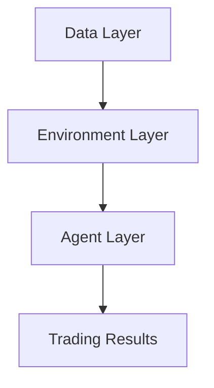

# FinRL Documentation

Welcome to the comprehensive documentation for **FinRL** - a Deep Reinforcement Learning library for financial markets!

## 🚀 What is FinRL?

FinRL is a powerful Python library that provides implementations of state-of-the-art deep reinforcement learning algorithms for financial applications, including:

- **Stock Trading**: Multi-asset portfolio management
- **Cryptocurrency Trading**: Real-time crypto trading strategies  
- **Portfolio Optimization**: Dynamic portfolio allocation
- **Risk Management**: Advanced risk metrics and controls

## 🏗️ Architecture Overview

FinRL follows a three-layer architecture:



- **Data Layer**: Data collection, preprocessing, and feature engineering
- **Environment Layer**: Trading environments (Gym-compatible)
- **Agent Layer**: RL algorithms (A2C, PPO, DDPG, SAC, TD3)

## ⚡ Quick Start

```python
from finrl.meta.preprocessor.yahoodownloader import YahooDownloader
from finrl.meta.preprocessor.preprocessors import FeatureEngineer
from finrl.meta.env_stock_trading.env_stocktrading import StockTradingEnv
from finrl.agents.stablebaselines3.models import DRLAgent

# 1. Download data
df = YahooDownloader(
    start_date="2020-01-01",
    end_date="2023-01-01", 
    ticker_list=["AAPL", "GOOGL", "MSFT"]
).fetch_data()

# 2. Process features
fe = FeatureEngineer(use_technical_indicator=True)
processed = fe.preprocess_data(df)

# 3. Create environment
env = StockTradingEnv(df=processed, **env_kwargs)

# 4. Train agent
agent = DRLAgent(env=env)
model = agent.get_model("ppo")
trained_model = agent.train_model(model, total_timesteps=50000)
```

## 📚 Documentation Sections

### Getting Started
- [Overview](getting-started/overview.md) - Library overview and concepts
- [Installation](getting-started/installation.md) - Installation guide
- [Quick Start](getting-started/quickstart.md) - Your first trading agent

### Architecture
- [Core Components](architecture/core-components.md) - Main library components
- [Environment Layer](architecture/environment-layer.md) - Trading environments
- [Agent Layer](architecture/agent-layer.md) - RL algorithms
- [Data Layer](architecture/data-layer.md) - Data processing pipeline

### API Reference
- [Environment Classes](api/environments.md) - Trading environment APIs
- [Agent Classes](api/agents.md) - RL agent implementations
- [Data Processing](api/data-processing.md) - Data preprocessing tools
- [Utilities](api/utilities.md) - Helper functions and tools

### Training & Evaluation
- [Algorithm Configuration](training/algorithm-config.md) - RL algorithm parameters
- [Performance Metrics](evaluation/performance-metrics.md) - Backtesting and evaluation
- [Visualization](evaluation/visualization.md) - Plotting and analysis tools

### Advanced Features
- [Custom Environments](advanced/custom-environments.md) - Build custom trading environments
- [Ensemble Methods](advanced/ensemble-methods.md) - Multi-model strategies
- [Paper Trading](advanced/paper-trading.md) - Live trading integration

## 🎯 Key Features

!!! tip "Multi-Algorithm Support"
    FinRL supports 5 state-of-the-art RL algorithms: A2C, PPO, DDPG, SAC, and TD3

!!! info "Flexible Environments"
    Pre-built environments for stocks, crypto, and portfolio optimization

!!! success "Performance Tracking"
    Comprehensive backtesting with 20+ financial metrics

!!! warning "Risk Management"
    Built-in turbulence detection and risk controls

## 🤝 Contributing

We welcome contributions! See our [Development Setup](contributing/development.md) guide to get started.

## 📄 License

This project is licensed under the MIT License.

## 🔗 Links

- [GitHub Repository](https://github.com/AI4Finance-Foundation/FinRL)
- [Paper](https://papers.nips.cc/paper/2020/hash/1577d6b4e6de31bb93e24f14c0a87ee9-Abstract.html)
- [Tutorials](https://github.com/AI4Finance-Foundation/FinRL-Tutorials)