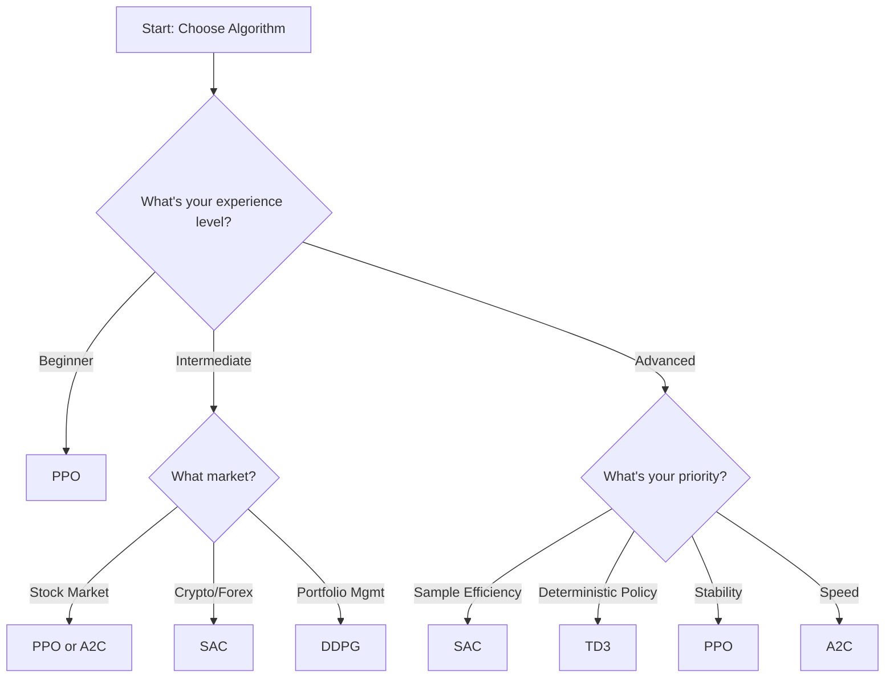

# Algorithm Selection Guide

Choosing the right reinforcement learning algorithm is crucial for successful financial trading. This guide helps you select the best algorithm based on your specific requirements.

## Algorithm Overview

| Algorithm | Type | Learning Style | Best For | Pros | Cons |
|-----------|------|---------------|----------|------|------|
| **PPO** | On-policy | Stable, conservative | General trading, beginners | Stable, reliable | Slower convergence |
| **SAC** | Off-policy | Sample efficient | Crypto, high-frequency | Very efficient | Complex tuning |
| **A2C** | On-policy | Fast, simple | Quick prototyping | Fast training | Less stable |
| **DDPG** | Off-policy | Deterministic | Portfolio optimization | Deterministic policies | Requires noise |
| **TD3** | Off-policy | Improved DDPG | Advanced trading | Reduced overestimation | Complex setup |

## Decision Tree



## Detailed Algorithm Profiles

### PPO (Proximal Policy Optimization)

**🎯 Best For:**
- Beginners to RL
- Stock trading strategies
- Long-term investment approaches
- Stable, reliable performance

**📊 Characteristics:**
- **Learning Type**: On-policy
- **Policy**: Stochastic
- **Sample Efficiency**: Moderate
- **Stability**: High
- **Training Speed**: Moderate

**💡 When to Choose PPO:**
```python
# Choose PPO if you want:
scenarios = [
    "First time using RL for trading",
    "Stock market with daily data", 
    "Need stable, predictable training",
    "Portfolio optimization with multiple assets",
    "Long-term buy-and-hold strategies"
]
```

**⚙️ Configuration Example:**
```python
ppo_config = {
    "learning_rate": 3e-4,
    "n_steps": 2048,
    "batch_size": 64,
    "ent_coef": 0.01,
    "clip_range": 0.2,
    "n_epochs": 10
}

model = agent.get_model("ppo", model_kwargs=ppo_config)
```

### SAC (Soft Actor-Critic)

**🎯 Best For:**
- Cryptocurrency trading
- High-frequency trading
- Sample-efficient learning
- Continuous trading environments

**📊 Characteristics:**
- **Learning Type**: Off-policy
- **Policy**: Stochastic with entropy regularization
- **Sample Efficiency**: Very High
- **Stability**: High (with proper tuning)
- **Training Speed**: Fast

**💡 When to Choose SAC:**
```python
# Choose SAC if you have:
scenarios = [
    "Limited training data",
    "24/7 crypto markets",
    "Need maximum sample efficiency",
    "Continuous action spaces",
    "Online learning requirements"
]
```

**⚙️ Configuration Example:**
```python
sac_config = {
    "learning_rate": 3e-4,
    "buffer_size": 100000,
    "batch_size": 256,
    "ent_coef": "auto",
    "learning_starts": 1000,
    "train_freq": (1, "step")
}

model = agent.get_model("sac", model_kwargs=sac_config)
```

### A2C (Advantage Actor-Critic)

**🎯 Best For:**
- Quick prototyping
- Simple trading strategies
- Resource-constrained environments
- Fast iteration cycles

**📊 Characteristics:**
- **Learning Type**: On-policy
- **Policy**: Stochastic
- **Sample Efficiency**: Low
- **Stability**: Moderate
- **Training Speed**: Very Fast

**💡 When to Choose A2C:**
```python
# Choose A2C if you need:
scenarios = [
    "Rapid prototyping and testing",
    "Simple buy/sell strategies",
    "Limited computational resources",
    "Quick baseline models",
    "Educational purposes"
]
```

**⚙️ Configuration Example:**
```python
a2c_config = {
    "learning_rate": 7e-4,
    "n_steps": 5,
    "ent_coef": 0.01,
    "vf_coef": 0.25,
    "gamma": 0.99
}

model = agent.get_model("a2c", model_kwargs=a2c_config)
```

### DDPG (Deep Deterministic Policy Gradient)

**🎯 Best For:**
- Portfolio weight optimization
- Deterministic trading policies
- Continuous control problems
- Risk-averse strategies

**📊 Characteristics:**
- **Learning Type**: Off-policy
- **Policy**: Deterministic
- **Sample Efficiency**: High
- **Stability**: Moderate (needs action noise)
- **Training Speed**: Fast

**💡 When to Choose DDPG:**
```python
# Choose DDPG if you want:
scenarios = [
    "Deterministic portfolio allocations",
    "Precise position sizing",
    "Risk-controlled strategies",
    "Continuous action spaces",
    "Market making strategies"
]
```

**⚙️ Configuration Example:**
```python
ddpg_config = {
    "learning_rate": 1e-3,
    "buffer_size": 50000,
    "batch_size": 128,
    "tau": 0.005,
    "action_noise": "ornstein_uhlenbeck",
    "train_freq": (1, "episode")
}

model = agent.get_model("ddpg", model_kwargs=ddpg_config)
```

### TD3 (Twin Delayed DDPG)

**🎯 Best For:**
- Advanced trading strategies
- Improved DDPG performance
- Reduced overestimation bias
- Professional trading systems

**📊 Characteristics:**
- **Learning Type**: Off-policy
- **Policy**: Deterministic
- **Sample Efficiency**: High
- **Stability**: High
- **Training Speed**: Moderate

**💡 When to Choose TD3:**
```python
# Choose TD3 if you need:
scenarios = [
    "Improved DDPG performance",
    "Reduced overestimation problems",
    "Advanced portfolio optimization",
    "Professional trading systems",
    "Maximum performance requirements"
]
```

**⚙️ Configuration Example:**
```python
td3_config = {
    "learning_rate": 1e-3,
    "buffer_size": 1000000,
    "batch_size": 100,
    "policy_delay": 2,
    "target_policy_noise": 0.2,
    "target_noise_clip": 0.5
}

model = agent.get_model("td3", model_kwargs=td3_config)
```

## Use Case Recommendations

### Stock Trading (Daily/Hourly Data)

**Recommended:** PPO → A2C → SAC

```python
# Stock trading priority
algorithms_by_preference = {
    1: "PPO",    # Most stable for stock markets
    2: "A2C",    # Fast prototyping
    3: "SAC"     # If sample efficiency needed
}
```

**Rationale:**
- Stock markets have clear patterns PPO can learn
- Daily data provides stable learning environment
- PPO's conservative approach suits regulated markets

### Cryptocurrency Trading (24/7 Data)

**Recommended:** SAC → PPO → TD3

```python
# Crypto trading priority
algorithms_by_preference = {
    1: "SAC",    # Best for continuous markets
    2: "PPO",    # Stable fallback
    3: "TD3"     # Advanced strategies
}
```

**Rationale:**
- 24/7 markets benefit from sample-efficient SAC
- High volatility requires robust exploration
- Continuous action spaces suit crypto trading

### Portfolio Optimization

**Recommended:** DDPG → TD3 → PPO

```python
# Portfolio optimization priority
algorithms_by_preference = {
    1: "DDPG",   # Deterministic allocations
    2: "TD3",    # Improved DDPG
    3: "PPO"     # Multi-asset stability
}
```

**Rationale:**
- Portfolio weights are continuous decisions
- Deterministic policies provide clear allocations
- Risk management benefits from deterministic actions

### High-Frequency Trading

**Recommended:** SAC → TD3 → DDPG

```python
# HFT priority
algorithms_by_preference = {
    1: "SAC",    # Maximum sample efficiency
    2: "TD3",    # Fast, deterministic decisions
    3: "DDPG"    # Continuous control
}
```

**Rationale:**
- Sample efficiency critical for real-time learning
- Fast decision-making required
- Continuous action spaces for precise timing

## Performance Comparison

### Training Speed (Fastest to Slowest)
1. **A2C** - Simple, fast updates
2. **SAC** - Efficient off-policy learning
3. **DDPG/TD3** - Moderate complexity
4. **PPO** - Conservative, thorough updates

### Sample Efficiency (Most to Least Efficient)
1. **SAC** - Superior off-policy learning
2. **TD3** - Improved experience reuse
3. **DDPG** - Good experience reuse
4. **PPO** - Moderate efficiency
5. **A2C** - Simple on-policy learning

### Stability (Most to Least Stable)
1. **PPO** - Designed for stability
2. **SAC** - Entropy regularization helps
3. **TD3** - Improved over DDPG
4. **A2C** - Simple but can be unstable
5. **DDPG** - Requires careful tuning

## Quick Selection Guide

**🚀 Quick Start (Beginner):**
```python
# Safe, reliable choice
algorithm = "ppo"
reason = "Stable, well-documented, good for learning"
```

**⚡ Maximum Performance:**
```python
# Best performance, requires tuning
algorithm = "sac"
reason = "Most sample efficient, handles complex environments"
```

**🎯 Deterministic Trading:**
```python
# Clear, interpretable decisions
algorithm = "ddpg"  # or "td3" for improved version
reason = "Deterministic policies, clear position sizing"
```

**🔄 Rapid Prototyping:**
```python
# Fast iteration, quick testing
algorithm = "a2c"
reason = "Fastest training, simple setup"
```

## Algorithm Migration Path

As you gain experience, consider this progression:

```python
learning_path = {
    "Beginner": "A2C → PPO",
    "Intermediate": "PPO → SAC",
    "Advanced": "SAC → TD3",
    "Expert": "Ensemble methods"
}
```

### Migration Tips

1. **Start Simple**: Begin with A2C or PPO
2. **Understand Basics**: Learn RL fundamentals
3. **Advance Gradually**: Move to SAC for efficiency
4. **Optimize Performance**: Use TD3 for maximum performance
5. **Combine Strategies**: Eventually use ensemble methods

## Common Mistakes to Avoid

### ❌ Wrong Algorithm Choice

```python
# Don't use A2C for complex, sample-limited environments
# Don't use DDPG without action noise
# Don't use SAC without understanding entropy tuning
```

### ✅ Correct Approach

```python
# Match algorithm to problem characteristics
# Consider your experience level
# Start with proven configurations
# Test multiple algorithms if unsure
```

## Next Steps

1. **Choose Algorithm**: Use this guide to select
2. **Configure Parameters**: See [Training Configuration](training-configuration.md)
3. **Set Up Training**: Follow [Training Process](training-process.md)
4. **Tune Hyperparameters**: Use [Hyperparameter Tuning](hyperparameter-tuning.md)

Remember: The best algorithm depends on your specific use case, data characteristics, and computational constraints. When in doubt, start with PPO for stability or SAC for efficiency.